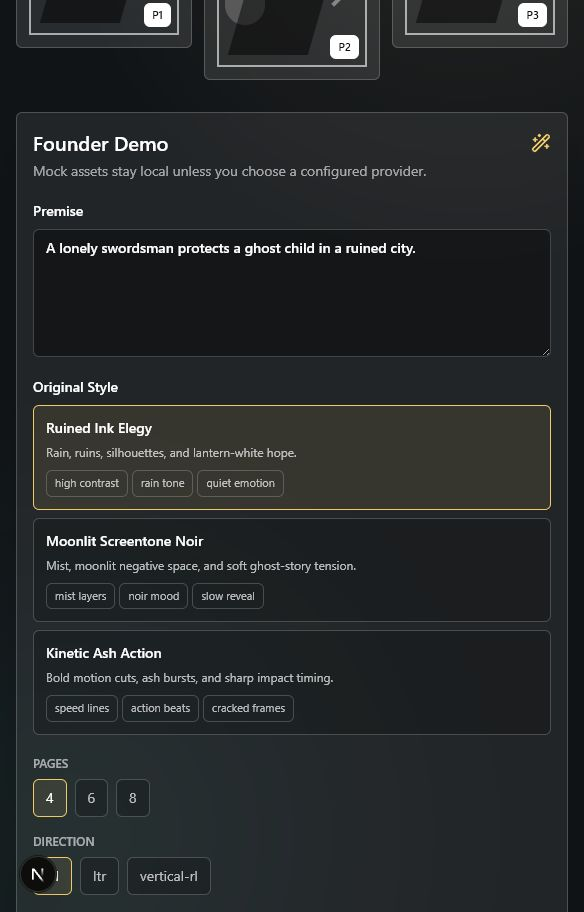

# Founder Demo Mode

Founder Demo Mode is the one-button Manga AI Studio walkthrough. It creates a complete draft manga project from a premise using deterministic local mock providers by default, so it works without paid API keys.

## Run It

1. Start the local stack:

```bash
docker compose up --build
```

2. Open the app:

```text
http://localhost:3000/demo
```

3. Keep the default premise or edit it:

```text
A lonely swordsman protects a ghost child in a ruined city.
```

4. Choose an original style option, page count, reading direction, quality mode, and provider.

5. Click **Generate Manga Demo**.

The default `mock` provider is deterministic and local. If `openai` or `comfyui` is selected without the required environment variables, the backend can fall back to mock assets when `allow_mock_assets` is enabled.

## API

```http
POST /demo/founder-run
```

```json
{
  "premise": "A lonely swordsman protects a ghost child in a ruined city.",
  "style_option": "ruined_ink_elegy",
  "page_count": 4,
  "reading_direction": "rtl",
  "render_provider": "mock",
  "quality_mode": "fast",
  "allow_mock_assets": true
}
```

Response:

```json
{
  "job_id": "uuid",
  "project_id": "uuid"
}
```

Poll:

```http
GET /jobs/{job_id}
GET /jobs/{job_id}/events
```

## Timeline Events

- `creating_project`
- `writing_story_bible`
- `designing_characters`
- `creating_style_dna`
- `planning_pages`
- `drawing_layouts`
- `lettering_pages`
- `rendering_panels`
- `composing_final_pages`
- `checking_quality`
- `exporting_files`
- `complete`

The job also starts with the existing `queued` event and uses `failed` for recoverable error reporting.

## Expected Output

A successful run creates:

- 1 project named `Ghost Lantern`
- 1 story bible
- 2 character cards
- 1 location and 1 key object
- 1 original style bible / Style DNA record
- 1 chapter
- 4, 6, or 8 pages depending on the selector
- 3 panels per page
- bubbles and narration boxes
- deterministic mock manga-style panel PNGs
- composed final page PNGs
- page QA reports
- ZIP and PDF exports

The mock panel art intentionally shows placeholder visual language: panel borders, screentone, rain or speed lines, character silhouettes, lantern accents, dialogue bubbles, page number, and panel number.

## Verified Local Smoke Test

This pass verified:

- `POST /demo/founder-run` completed against the running Docker Compose stack.
- A 4-page mock run produced 12 panel renders, 4 composites, 4 QA reports, protected asset provenance, and ZIP/PDF exports.
- `/demo` loaded in browser smoke with the prefilled premise, 3 style options, the generate button, live timeline, QA reveal, export buttons, and Open in Studio flow.
- Frontend production build and Playwright smoke include the `/demo` route.



## Known Limitations

- Mock provider output is polished placeholder art, not real generative model art.
- The demo is deterministic and optimized for a founder walkthrough, not arbitrary long-form story quality.
- Real OpenAI and ComfyUI rendering remain optional provider paths and require valid environment configuration.
- Job progress is event polling through `GET /jobs/{id}/events`; WebSocket/SSE is not required for this MVP.
- Export buttons appear after the backend finishes the export stage.
